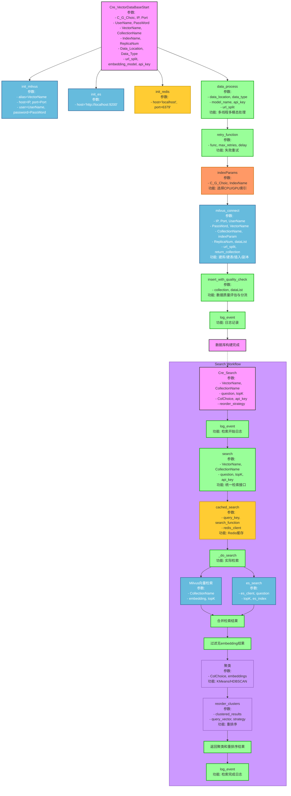

## Introduction
为什么要做这个,对于RAG的检索数据和性能,不一定要按照宁可获取的数据多,也不能少的原则,而是要达到一个性能和数据量之间的平衡。通过聚类算法，将相似的数据聚在一起，从而提高检索性能。除此之外,也是想做一个方便的接口,只需要输入参数,即可获取一个高性能(我自己认为的,目前没有安排分布式....)的向量数据库方案。
### 基础功能
可快速接入项目的Milvus向量数据库方案，:done
提供CPU和GPU索引选择，:done
登录加密、:done
数据聚类分块选择，done
内存副本以提高吞吐，:done
多模态数据（文本、文件、图片）自动化处理和存储。:done

## 优化
1. 加入ES进行多路召回
2. 加入缓存（Redis），优化检索性能。
3. 结合基于k8s的日志监控
4. 对结果重排序，将相似的内容分到一起
5. 分布式？内存分片？
6. 文件处理多线程。done
7. 处理失败后重试机制
8. 数据质量评估并标记，将低质量的数据分为其他的collection中

## 项目流程图（自动生成的）

### 关于聚类的时机
下面有三种使用聚类算法的时机：
1. 如果检索性能是首要目标：
   * 在数据存储时进行聚类，并将聚类标签存储到数据库中。
   * 检索时直接利用聚类标签快速定位相关数据
2. 如果数据动态变化比较频繁：
   * 在检索时对召回的数据进行分类，动态分析数据分布
3. 如果需要离线数据分析
   * 定期对数据进行聚类，用于分析或推荐系统
请理解聚类的概念,可以参考哔哩哔哩中zilliz的讲解视频,在二维平面上,运用聚类算法可以更好的将相似的数据聚在一起，从而提高检索性能。
> 目前采用的方案一:性能作为首选目标

### 关于重排序
有四种方案
1. 基于距离的重排序
   * 在二维平面中,每个聚类都有聚类中心向量,将每个聚类的结果按照与中心向量的距离进行重排序,优先返回距离比较近的结果
2. 基于聚类大小的重排序
   * 按照聚类的大小(每个聚类中包含的结果数量)从大到小排序,优先返回较大的聚类
3. 基于聚类中心的重排序
   * 计算每个聚类的中心点,按质心与查询向量的距离从小到大排序
4. 基于特定业务的重排序
   * 你自己怎么想的就怎么做

